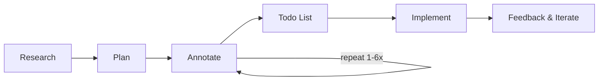

I recently read an article by a blogger named Boris Tane about his experience using Claude Code. Many of his points resonated with my own thinking.

Original article:

[How I Use Claude Code | Boris Tane](https://boristane.com/blog/how-i-use-claude-code/)

Boris Tane is an entrepreneur who previously worked at Cloudflare as a software engineer and later focused on AI-related software development.

In this article, Boris summarizes his experience using Claude Code.

If you don't write code, I strongly recommend reading it — many of the lessons translate to other types of work.

## Boris's Key Takeaways

Boris summarizes three main ideas: **separating workflows**, **document-based collaboration**, and **long sessions**.

**Separating workflows** means breaking a task into multiple steps:
- Research
- Planning
- Implementation
- Reviewing

First, during research Boris instructs Claude not to write code immediately but to produce a planning document first. In this stage he prompts Claude to think thoroughly — using language such as "deeply", "in great detail", "the intricacies", and "go through everything" — to encourage comprehensive thinking.

Then, in the planning phase, Boris and Claude iterate on the plan document: which parts are unreasonable, which can be optimized, and so on. They refine the plan repeatedly until they reach agreement. During this process Boris often points Claude to good open-source practices as references.

Only after everything is prepared does Boris ask Claude to modify code. If issues arise, he asks Claude to revise. Finally, he reviews and commits the changes.

Boris emphasizes paying special attention to research and planning — these stages are prerequisites for correct execution. This phase is often repeated 1–6 times.

You may notice Boris uses a document as the collaboration surface — this is **document-based collaboration** (a shared mutable state) where the plan is visible and never lost.

Also important is Boris's use of **long sessions**: for each task he keeps a single chat session open and completes all steps within it. This matters because the AI's context equals the chat window's context. If each step started a new session, Claude would lose parts of the task context.

## About Saving Costs

Boris notes that this workflow can significantly reduce token usage because it avoids premature, unprepared output from Claude that wastes tokens. In my experience, this depends on the billing model of the AI tool. If you're billed by tokens, the workflow is effective. But if you use tools billed per request (like some Copilot-style services), a better strategy is to first assess task complexity and then decide whether the full workflow is worth it.

For simple tasks, a single direct edit may be enough and more cost-effective.

## "Human Attention" Is the Core Human Advantage

Boris also stresses staying in the driver's seat: always remember the AI is your tool, not your replacement.

What Boris doesn't fully highlight is that his workflow fundamentally injects human experience into the task. The AI remains an object in the process; it doesn't know the project's requirements or the users' preferences — those must come from the engineer.

I call this unique human capability "human attention" — it is the core competitive advantage people should cultivate in the AI era.

---

Hansen, written on 2026-03-05
