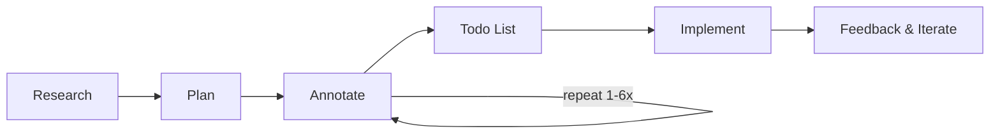

最近读到一篇文章，是一位名为 Boris Tane 的博主分享了自己使用 Claude Code 的经验。其中很多内容与我的想法不谋而合。

文章原文：

[How I Use Claude Code | Boris Tane](https://boristane.com/blog/how-i-use-claude-code/)

Boris Tane 是一名创业者，之前工作于 Cloudflare，工作是软件工程师，后来就开始做 AI 相关的软件开发。

Boris 在这篇文章中总结了他在使用 Claude Code 的一些经验。

**如果你不会写代码，也强烈建议你阅读，其中经验也可以迁移到其他工作上！**

## Boris 的经验之谈

Boris 主要总结了三点经验：**流程分离、文档协作和长 Session 对话**。

**流程分离**，就是将任务分解为多个步骤：
- 调研（Research）
- 规划（Planning）
- 执行（Implmentation）
- 检查（Reviewing）

首先，在调研中，Boris 明确告知 Claude 不要立即写代码，而是先提供一个规划文档。在这个过程中，要充分引导 Claude 进行全面的思考。使用语言例如：深刻地（deeply），详尽地（in great details），尽可能全面的（intricacies），检查所有地方（go throught everything）。

然后，规划阶段，Boris 通过文档和 Claude 一起修改方案：哪些地方是不合理的？哪些地方还可以优化的？之后再让 Claude 反复修改斟酌。直到我们对规划文档达成共识。在这个过程里， Boris 还会不时提供一些好的开源实践让 Claude 来参考。

一切都准备好之后，Boris 才让 Claude 修改代码，如遇问题，再让 Claude 修改。最后检查提交。

Boris 提到要特别关注调研和规划阶段，这是任务正确执行的先决条件。这一阶段往往要重复 1-6 次。

你也许注意到了，Boris 使用文档和 Claude 协作，这便是**文档协作**。Boris 将其总结为“协作界面”（Shared Mutable State），一切方案就在眼前，而且永远不会丢失。

另外，在与 AI 对话过程中，Boris 使用了**长 Session**。就是对于每一个任务，他只开一个聊天窗，所有的步骤均在这里完成。这点很重要，因为 AI 的视野范围就是其上下文的范围，单个聊天窗中包含所有当次任务必备的所有信息，如果每个步骤都另起一个聊天窗，Claude 就会丢失一部分信息。

## 关于省钱

Boris 还提到，使用以上工作方式，Token 的用量会大大降低，因为避免了 Claude 在还未准备完毕时就输出无用的修改意见，从而避免了浪费。

但在我的经验里，要分情况。这取决于你使用的 AI 软件。如果是按照 Token 计费的软件，是有效的。但是如果使用 vscode copilot 这类按次计费的工具，更好的策略是先评估任务的复杂度，然后再确定是否要执行以上流程。

对于简单的任务，单次直接修改就足以解决问题，反而更省钱。

## “人类注意力”是人的核心竞争力

Boris 也提到，在使用 AI 时，最重要的是“**始终做一个驾驶员（Staying in the Driver`s seat）**”。永远记住，AI 是你最称手的工具，而不是整个替代你。

不过在文章中，Boris 并未提到一个核心：他的工作流本质上就是将人类的经验注入到任务里。因为 AI 在任务中始终是“客体”，它既不了解项目的需求，也不了解其背后的用户偏好，这一切还需要工程师来完成。

这种独特的“人类经验”，我称之为“人类注意力”。这也是人类在 AI 时代应有的核心竞争力。

---

浩森，写于 2026-03-05