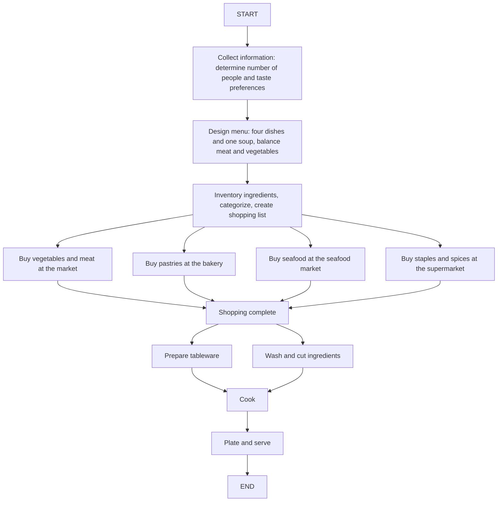

Agents are extremely popular right now. Friends around me, from different ages and professions, keep asking the same question: "What does it mean to build an OpenClaw Agent?"

OpenClaw's technology isn't particularly novel — AutoGPT has been around for more than a year and offers much of the same functionality.

Similarly, tools programmers use every day, like Cursor or Claude Code, have long been able to generate terminal commands to automate operations on their machines.

What made OpenClaw stand out was that it packaged a set of computer-operating tools together and presented itself as a standalone piece of software tied to the concepts of "digital workers" and "automation agents," enabling viral adoption.

There has already been much discussion about the marketing and community reaction on Reddit:

[Anyone actually using Openclaw? : r/LocalLLaMA](https://www.reddit.com/r/LocalLLaMA/comments/1r5v1jb/anyone_actually_using_openclaw/)

This article doesn't examine OpenClaw itself. Instead, it explores the underlying logic: what does it mean to "raise an OpenClaw Agent," and how do you implement an Agent?

## OpenClaw Agent and Agents

An OpenClaw Agent is, simply put, an Agent.

Quoting Stuart Russell's textbook, Artificial Intelligence: A Modern Approach:

> An agent can be defined as anything that perceives its environment through sensors and acts upon that environment through actuators.

In theory, anything that processes information and acts is an agent: an employee, a self-driving car, or your home robot vacuum.

OpenClaw bundled a series of tools capable of operating a computer and used large language models (LLMs) for reasoning and planning. In that sense, it is a "software-form Agent that uses LLMs." 

## An example: cooking a meal together

So how do you design an Agent? I'll use cooking as an example: how do you prepare a good meal for a group?

First, you need to know how many people are eating and each person's taste preferences; you might even call a few guests to ask.

Then design the menu: how many dishes, balance of meat and vegetables, maybe four dishes and one soup.

Next, list the ingredients and categorize them — vegetables, meat, pastries, seafood, staples, spices — and make a shopping list. If you can't remember everything, write the list down, since different ingredients might require trips to different stores.

Finally, act: buy ingredients, prepare tableware, wash and cut, cook, plate, and serve.

You can view yourself as an Agent in this scenario: you gather information (recipes, guest info), think and plan, then act to produce the meal.

## Three steps to design an Agent

Analogous to the cooking example, we can outline how to design an Agent.

LangChain, a popular Agent development framework, documents how to design Agents in detail:

[Thinking in LangGraph - Docs by LangChain](https://docs.langchain.com/oss/python/langgraph/thinking-in-langgraph#start-with-the-process-you-want-to-automate)

In summary, it's just three steps:

**First, define the task.** For example, "cook a meal for 10 people."

**Second, break down the main steps needed to complete the task** and turn them into a flow. While doing this, ask:
- Which parts should be handled by the LLM? Reflection, summarization, and planning are natural LLM tasks.
- What information must be collected? An Agent should consider all necessary information before acting to avoid bias or mistakes.
- What actions are needed? This determines which tools should be exposed to the Agent; if a tool doesn't exist yet, it needs to be implemented.
- Which steps require user queries? An Agent's perspective is limited — asking the user at the right times helps ensure correct outcomes.

The cooking process can be decomposed as:

**Third, define what information should be remembered.** During task execution, record intermediate conclusions and outputs from each step.

In the cooking example, items to remember include guest taste preferences, chosen recipes, and the shopping list.

After completing these three steps, you have designed an Agent.

## Some reflections

OpenClaw's viral rise at least shows one thing: society is highly attentive to LLM Agents.

This wave has been a good education for users of all kinds of Agent products — it demonstrates what Agents can do, where their limits lie, and what results to expect.

But my main point remains: human experience is still irreplaceable.

You may have noticed that Agents still mimic the human process of perceiving and acting in the world. Agents free humans from repetitive, already-solved tasks — but the knowledge embodied in those tasks remains human expertise.

So how should humans adapt in the AI era?

The answer: think diligently, cultivate unique experience, train abilities others don't have, and try to view the world from distinct perspectives.

---

Hansen, 2026-03-12
