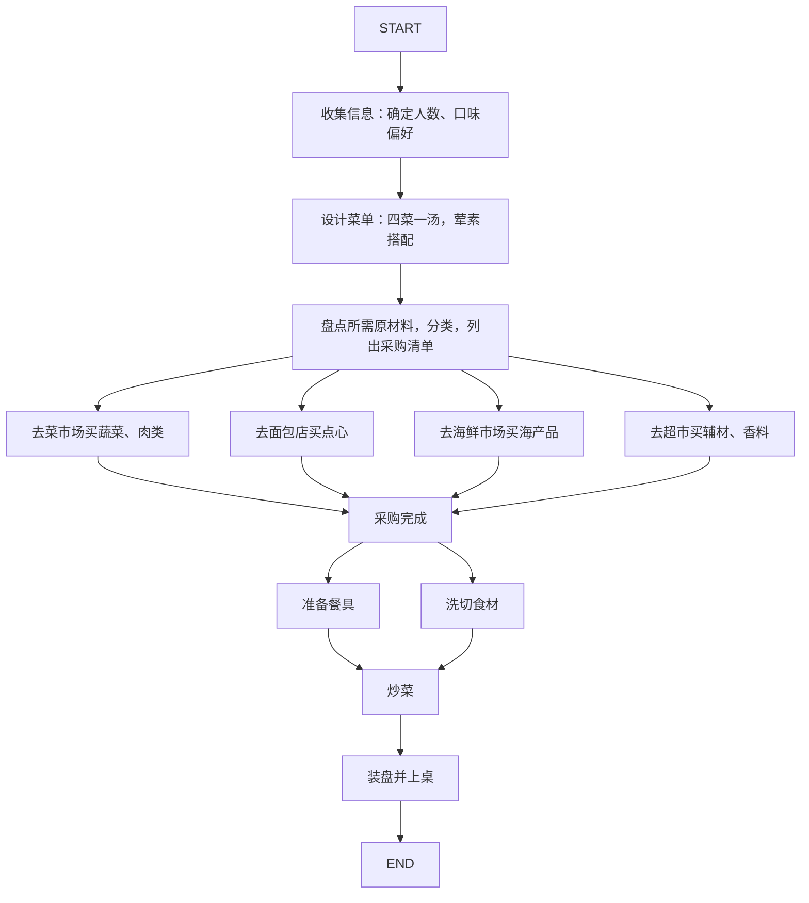

龙虾实在是太火了，身边的朋友不管男女老少，各行各业都在问我同一个问题：“什么是养龙虾？”

OpenClaw 的技术并不先进，早在一年多前就有 AutoGPT 了，他们都是一样的功能。

另外，程序员们每天都在用的 Cursor 或 Claude Code，也早就可以用生成“终端命令”的方式自动操作自己的计算机。

只是 OpenClaw 作为一个独立的软件呈现在大家面前，和“数字员工”、“自动化 Agent”的概念绑一起，形成病毒式传播。

关于这里的营销问题，在 reddit 上已有很多讨论。

[Anyone actually using Openclaw? : r/LocalLLaMA](https://www.reddit.com/r/LocalLLaMA/comments/1r5v1jb/anyone_actually_using_openclaw/)

这篇文章不谈 OpenClaw 本身，只谈它背后的底层逻辑：**什么是养龙虾？以及如何实现一个 Agent**

## 🦞小龙虾和 Agent

小龙虾就是 Agent（智能体）。

引用 Stuart Russell 的 《人工智能·现代方法》这本教科书里的定义：

> 智能体可以被定义为任何能够通过传感器感知其环境，并通过执行器对该环境采取行动的实体

所以理论上，所有能处理信息并行动的东西，都是 Agent：一名员工，一辆自动驾驶汽车，或者你家的扫地机器人。

只不过 OpenClaw 集成了一系列能够操作计算机的工具，并且利用 LLM 来思考和规划。

所以，它也是“使用 LLM 的软件形式的 Agent”。

## 举个例子：一起来做饭吧

那么，如何设计一个 Agent 呢？

我想用做饭举个例子：如何做出一桌子好吃的菜？

首先，第一步，你得搞清楚几个人吃饭，他们的口味偏好分别是什么，这时候，也许你要打几个电话给你的食客们。

然后，设计一下要做什么菜。荤素搭配，营养均衡，四菜一汤？

接着，盘点要哪些原材料，把他们分成蔬菜、肉类、点心、海产品、辅材、香料调味料。

记不住的话最好列个清单，因为不同的食材大概要去不同的地方才能买到。

最后，开始行动，买菜、准备餐具、洗切、炒菜、装盘、上桌。

在这个过程里，你可以把你自己当作一个 Agent：你收集了一些信息，例如菜谱，人员信息，接着经过一些思考与规划，然后行动，最终做了一桌菜。

## 三步设计 Agent

类比到以上的例子，我们就可以尝试设计一个 Agent。

LangChain 是一个流行的 Agent 开发框架，它的一份说明文档，详细叙述了如何设计 Agent：

[Thinking in LangGraph - Docs by LangChain](https://docs.langchain.com/oss/python/langgraph/thinking-in-langgraph#start-with-the-process-you-want-to-automate)

总结一下，很简单只有三步：

**第一，定义任务是什么**，例如“给 10 个人做一桌菜”。

**第二，拆解完成任务的主要步骤**，并将它们做成一个流程图。在这个过程里，思考几个问题：
- 哪些需要使用 LLM 来处理的？反思、整理和规划都可以用 LLM 处理。
- 需要收集哪些信息？Agent 在行动前一定要全面考虑所有的信息，否则行动会产生偏差。
- 需要哪些行动？这关系到，需要开放哪些工具给 Agent，如果这些工具还不存在，那么还得开发一套。
- 哪些步骤需要询问用户的意见？Agent 视角毕竟有限，很多地方还要询问用户的意见，这样才能保证任务正确完成。

做饭的过程可以拆解成：

**第三，定义哪些信息需要记忆的**。任务执行过程中，要记录一些信息，例如：来自上个步骤的结论，以及当前步骤输出的结果。

在做饭的例子里，收集到的成员口味信息，查询到的菜谱，采购清单这些都是要记录的信息。

完成上述三个步骤之后，你就设计了一个 Agent。

## 一些思考

OpenClaw 的爆火至少说明了一个问题：**全社会对 LLM Agent 的关注度很高。**

这次大流行，对各类 Agent 产品来说，是很好的教育用户的过程：让大家都了解 Agent 能干什么，边界在哪，效果如何。

但其实，我最想说的还是那句话：**人类经验依然不可替代**。

你也许已经发现，Agent 模仿的依然是人类认识世界和行动的过程。

Agent 解放的，是已经被人类解决的，需要重复劳动的工作。其中凝结的，依然是人类的经验。

所以，在 AI 时代作为人应该怎么适应呢？

答案就是：**勤于思考，关注你自己独特的经验，训练他人没有的能力，并尝试用与众不同的视角看待这个世界。**

---

浩森，写于 2026-03-11